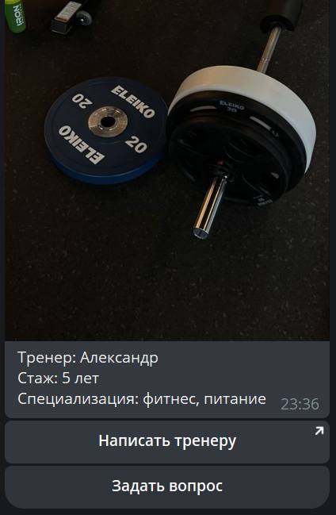
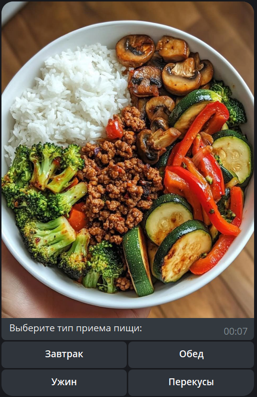
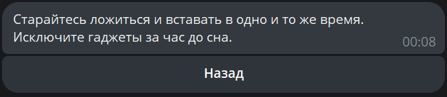
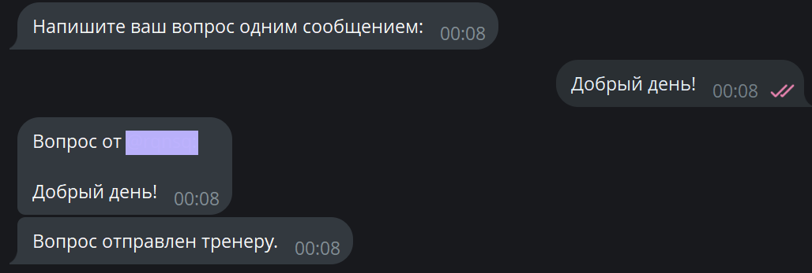

# Фитнес-ассистент

Простой бот-помощник для тренировок и контроля питания.
писал этот проект, чтобы разобраться с архитектурой `python-telegram-bot`, понять как работают колбэки и сделать нормальную навигацию без спама сообщениями.
*Для шлифовки скриптов использовал Gogle Gemini 3 Pro

# Функционал

* навигация по разделам: Питание, Тренировки, Сон
* инлайн-кнопки: контент меняется в одном сообщении (edit_message), а не шлется новыми
* обратная связь: можно отправить вопрос тренеру, бот перешлет его админу по ID
* анти-спам: простая защита от частого нажатия кнопок (throttling)
* фото: к разделам меню подтягиваются картинки по ссылкам

# Технологии

* Python 3
* `python-telegram-bot` (версия 13.x)
* `python-dotenv` для работы с переменными окружения

---

### 1. Одно из меню

сообщение с инлайн-клавиатурой и фотографией.

### 2. Подменю и контент

пример ответа после нажатия кнопки 'Питание' и выбора конкретной категории.

### 3. Ответ из "data"

подробный текстовый ответ с кнопкой "Назад" для удобного возврата.

### 4. Функция 'Вопрос тренеру'

диалог с пользователем после нажатия кнопки 'Задать вопрос' перед форвардингом сообщения.

---

rqnsq

